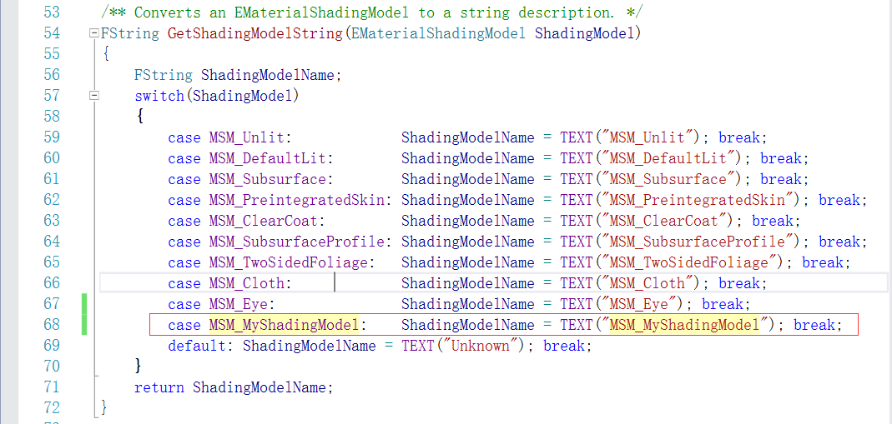

#订制自己的渲染模型#

##1、需求：##
Unreal引擎是使用github上下载的4.18.0-release版的源码自己编译的。  
参考网址：[点击这里](https://blog.felixkate.net/category/ue4/)。有很大一部分是参考这个网址上的。  

##2、告诉引擎我们新的渲染模型名称##
在Unreal引擎的源码中，打开EngineTypes.h，并在EMaterialShadingModel枚举中添加自己渲染模型名称，如图：
注意必须添加在MSM_MAX前面。

##3、告诉材质我们新的渲染模型名称##
在Unreal引擎的源码中，打开MaterialShared.cpp，在以下地方添加需改。如图：

##4、订制我们自己的想要开启的材质引脚##
在Unreal引擎的源码中，打开Material.cpp，在以下地方添加需要修改。如图：。这里我们开启了CustomData0引脚。在Material.cpp的IsPropertyActive接口中可以订制那些引脚开启和关闭。

##5、修改MaterialShared.cpp##
修改MaterialShared.cpp，然后Shader文件中可以识别我们自定义的Shader模型。修改如下：

##7、编译源码##
为了使得刚才的修改生效，我们编译Unreal引擎源码，来验证刚才的修改是否生效。编译没有报错，打开UEditor，然后创建一个材质，在材质界面就可以选择刚才自定义渲染模型，如图：。可以看到选择自定义渲染模型后，材质的引脚中CustomData0是激活了的。

##7、修改BasePassPixelShader.usf##
BasePassPixelShader.usf是Unreal引擎将材质里面各个引脚的数据写入GBuffer的一个shader。为了在blend设置为translucent或者additive模式下可以看见，我们需要修改的内容如下：

##8、修改ShadingModelsMaterial.ush##
ShadingModelsMaterial.ush是一个Pixel shader函数， 根据不同的shading model来计算GBuffer。修改如下：

##9、修改DeferredShadingCommon.usf##
DeferredShadingCommon.usf是deferred shading的各种共同的定义。这里我们定义了订制的渲染模型。修改如下：

##10、修改ShadingModels.ush##
ShadingModels.ush定义了各自渲染模型的实现方式。这里我们的修改如下：

##11、修改DeferredLightingCommon.ush##
DeferredLightCommon.ush定义了延迟渲染共同的灯光定义。这里我们并没有采取ue本身的对模型阴影和尖锐的边缘计算方式，而是采用了自己定义的。在这个文件的GetDynamicLighting接口中修改，修改如下：。

##12、修改BasePassCommon.ush##
BasePassCommon.ush是为vetex和pixel shader所定义的基础通道的定义。由于我们的渲染模型中使用了customdata，所以需要在这里做修改，在#define WRITES_CUSTOMDATA_TO_GBUFFER中添加我们的渲染模型的定义。修改如下：

##13、编译shader错误##
由于之前没有打开Unreal的shader编译错误，所以出错来无法查找，需要在ConsoleVariables.ini中开启shader的开发模式。修改如下：。这样就可以在shader错误的时候提示错误原因了。对照修改。

##14、Editor中看效果##
如下图：

##15、总结##
上面只是说明了如何修改，很多地方都没有说明为什么，因为我自己也是刚开始学习，对unreal也有很多地方不明白的，以后再慢慢补上！

